# PokéFinder - Aplicación Web con Consumo de API

https://1ault.github.io/poke-finder/

## Estudiantes

-   Arles Lopez
-   Juan Garcia
-   Whitney Ault

## Capturas


## Instrucciones de uso

-   Tener internet
-   Abrir el index.html en un http server

## Link a GitHub Pages

[poke-finder](https://1ault.github.io/poke-finder/)

## Fuentes

### Info

Pokédex max: 1025

#2 IVYSAUR

#44 GLOOM

#65 ALAKAZAM

#67 MACHOKE

#133 EEVEE

#132 DITTO

#201 UNOWN

#252 TREECKO

#660 DIGGERSBY

#772 TYPE-NULL

#777 TOGEDEMARU
#10154 TOGEDEMARU-TOTEM

#999 GIMMIGHOUL

#1000 GHOLDENGO

battle-armor

#### Chain

#44 GLOOM

#201 UNOWN

#133 EEVEE

### Doc

[JsDoc](http://jsdoc.app/)

[Proyecto Semestral: PokéFinder - Aplicación Web con Consumo de API](https://gist.github.com/ErickAgrazal/93abdea87c98063df4bb3f8f3be66728)

[ErickAgrazal](https://gist.github.com/ErickAgrazal/93abdea87c98063df4bb3f8f3be66728)

[ErickAgrazal](https://github.com/ErickAgrazal/agrazal-erick-2025-1GS221/tree/master/explicaciones/9.%20Explicaci%C3%B3n%20sobre%20Edici%C3%B3n%20con%20LocalStorage)

[ErickAgrazal](https://github.com/ErickAgrazal/agrazal-erick-2025-1GS221/tree/master/explicaciones/8.%20Explicaci%C3%B3n%20sobre%20Arquitectura%20Modular%20JS)

### JS

#### Fn util

[capitalizeFirstLetter](https://stackoverflow.com/questions/1026069/how-do-i-make-the-first-letter-of-a-string-uppercase-in-javascript)

#### Api

[Consumo de API Pokémon (Estilo Brutalista)](https://github.com/ErickAgrazal/agrazal-erick-2025-1GS222/tree/master/explicaciones/10.%20Explicaci%C3%B3n%20sobre%20Consumo%20de%20API%20Pok%C3%A9mon)

https://pokeapi.co/

https://github.com/PokeAPI/cries

| Endpoint                        | Uso                          | Ejemplo                            |
| ------------------------------- | ---------------------------- | ---------------------------------- |
| `/pokemon/{name or id}`         | Datos básicos del Pokémon    | `/pokemon/pikachu` o `/pokemon/25` |
| `/pokemon-species/{name or id}` | Datos de especie (evolución) | `/pokemon-species/pikachu`         |
| `/evolution-chain/{id}`         | Cadena evolutiva completa    | `/evolution-chain/10`              |
| `/ability/{name or id}`         | Información de habilidad     | `/ability/static`                  |

##### Api Assets

`Sprite`

https://raw.githubusercontent.com/PokeAPI/sprites/master/sprites/pokemon/${id}.png

`Cries`

https://raw.githubusercontent.com/PokeAPI/cries/main/cries/pokemon/${variant}/${id}.og

legacy, latest

https://raw.githubusercontent.com/PokeAPI/cries/main/cries/pokemon/legacy/1.ogg

https://raw.githubusercontent.com/PokeAPI/cries/main/cries/pokemon/latest/1.ogg

#### Cadena de evolución

Arboles [^CLRS_ITA_10_4]

#### Cache

[LocalStorage](https://github.com/ErickAgrazal/agrazal-erick-2025-1GS222/tree/master/explicaciones/9.%20Explicaci%C3%B3n%20sobre%20Edici%C3%B3n%20con%20LocalStorage)

### CSS

[cssgridgarden](https://cssgridgarden.com/#es)

[flexboxfroggy](https://flexboxfroggy.com/#es)

[w3schools css3_variables](https://www.w3schools.com/css/css3_variables.asp)

[w3schools css3_gradients](https://www.w3schools.com/css/css3_gradients.asp)

#### Bg

[ErickAgrazal 221](https://github.com/ErickAgrazal/agrazal-erick-2025-1GS221)
[ErickAgrazal 222](https://github.com/ErickAgrazal/agrazal-erick-2025-1GS222)

[CSS Dotted](https://stackoverflow.com/questions/55364127/making-a-dotted-grid-with-css)

[CSS Dotted](https://stackoverflow.com/questions/55364127/making-a-dotted-grid-with-css/55364821#55364821)

#### Gradient

[mozilla linear-gradient](https://developer.mozilla.org/en-US/docs/Web/CSS/Reference/Values/gradient/linear-gradient)
[mozilla repeating-linear-gradient](https://developer.mozilla.org/en-US/docs/Web/CSS/Reference/Values/gradient/repeating-linear-gradient)

## Kanban

# 🎯 Proyecto poke-finder

## 📊 Tablero Kanban del Proyecto

```mermaid
---
config:
  kanban:
    ticketBaseUrl: 'https://github.com/1ault/poke-finder/issues/'
---
kanban
  Backlog
    AutocompleteBusqueda[Autocomplete Búsqueda<br/>#19 | P3 | S | 📌1997-bit]

  Ready
    NavegacionHabilidad[Navegación desde Habilidad<br/>#17 | P1 | S | 📌1ault | ✅]

  "In Progress"
    SistemaFavoritos[Sistema de Favoritos<br/>#8 | P0 | M | 📌1997-bit | ✅]
    HistorialBusquedas[Historial Búsquedas<br/>#9 | P1 | M | 📌1997-bit | ✅]

  "In Review"
    SistemaTipos[Sistema de Tipos<br/>#13 | P1 | L | 📌ArlesLopez | ✅]
    ComparadorEstadisticas[Comparador Stats<br/>#12 | P1 | M | ✅]
    DeterminacionGanador[Determinación Ganador<br/>#14 | P1 | M | 📌ArlesLopez | ✅]
    VistaHabilidad[Vista de Habilidad<br/>#16 | P0 | M | 📌1ault | ✅]
    TemaOscuro[Tema Oscuro<br/>#18 | P3 | S | 📌1ault | ✅]
    LayoutVSBattle[Layout VS Battle<br/>#11 | P0 | M | 📌ArlesLopez | ✅]
    CadenaEvolutiva[Cadena Evolutiva<br/>#20 | P0 | M | 📌1ault | ✅]
    ToggleBusqueda[Toggle Búsqueda<br/>#15 | P0 | M | 📌1ault | ✅]
    IndicadorCarga[Indicador carga<br/>#23 | P0 | S | 📌1ault | ✅]
    TemplateTarjeta[Template Tarjeta<br/>#7 | P0 | M | 📌1997-bit,1ault | ✅]

  Done
    MejoraCache[Mejora Caché<br/>#10 | P1 | S | 📌1997-bit | ✅]
    MensajeNoHay[Mensaje vacío<br/>#21 | P1 | 📌1997-bit | ✅]
    ClickHistorico[Click histórico<br/>#22 | P1 | 📌1997-bit | ✅]
    EntregaFinal[Entrega final<br/>#1 | P0 | XL | 📌Todos | ✅]
```



## Footnotes

[^CLRS_ITA_10_4]:
    Thomas H. Cormen, Charles E. Leiserson, Ronald L. Rivest, and Clifford Stein.
    _Introduction to Algorithms_, 4th Edition.
    MIT Press, 2022.
    Section 10.4 — “Representing Rooted Trees”, pp. 265–266.

```

```
